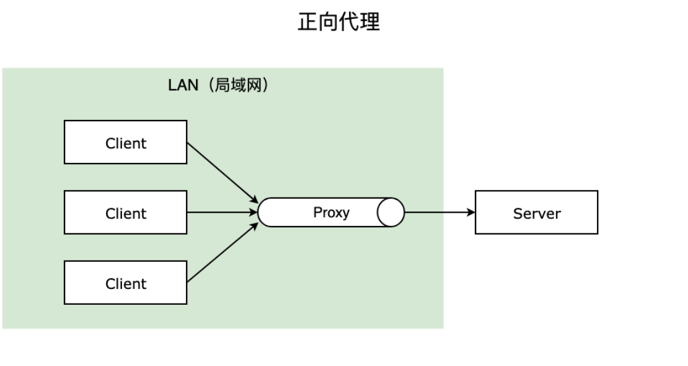
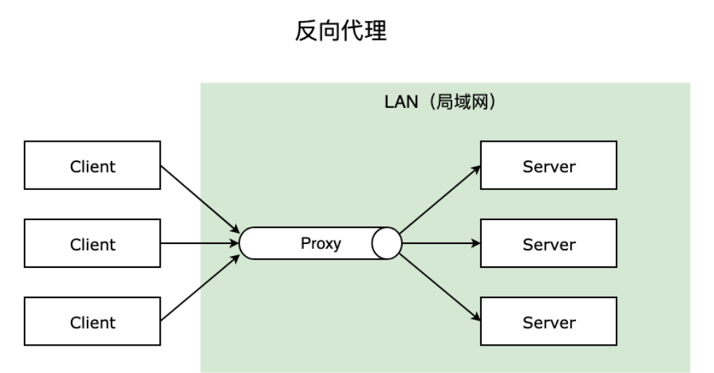
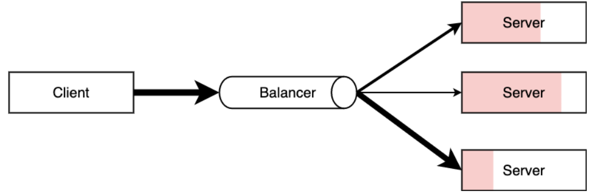

# Nginx

[toc]

> 源文件地址：[Nginx 从入门到实践，万字详解！ - NGINX开源社区](https://www.nginx.org.cn/article/detail/545/)

## Nginx 介绍

传统的 Web 服务器，每个客户端连接作为一个单独的进程或线程处理，需在切换任务时将 CPU 切换到新的任务并创建一个新的运行时上下文，消耗额外的内存和 CPU 时间，当并发请求增加时，服务器响应变慢，从而对性能产生负面影响。


`Nginx` 是`开源`、`高性能`、`高可靠`的 **Web** 和**反向代理服务器**，而且支持`热部署`，几乎可以做到 7 * 24 小时不间断运行，即使运行几个月也不需要重新启动，还能在不间断服务的情况下对软件版本进行热更新。性能是 Nginx 最重要的考量，其占用内存少、并发能力强、能支持**高达 5w 个并发连接数**，最重要的是，Nginx 是`免费的并可以商业化`，配置使用也比较简单。

### Nginx 的最重要的几个使用场景：

1. 静态资源服务，通过本地文件系统提供服务；
2. 反向代理服务，延伸出包括缓存、负载均衡等；
3. API 服务，OpenResty ；

对于前端来说` Node.js `不陌生了，`Nginx `和 `Node.js` 的很多理念类似，**HTTP 服务器**、**事件驱动**、**异步非阻塞等**，且 **==Nginx 的大部分功能使用 Node.js 也可以实现，但 Nginx 和 Node.js 并不冲突==**，都有自己擅长的领域。

`Nginx` 擅长于**底层服务器端资源的处理**（静态资源处理转发、反向代理，负载均衡等），

`Node.js` 更擅长**上层具体业务逻辑的处理**，两者可以完美组合，共同助力前端开发。

## 相关概念

### 简单请求和非简单请求	

首先我们来了解一下**简单请求**和**非简单请求**，如果同时满足下面两个条件，就属于`简单请求`：

1. 请求方法是 `HEAD`、`GET`、`POST` 三种之一；
2. HTTP `头信息不超过`右边着几个字段：`Accept`、`Accept-Language`、`Content-Language`、`Last-Event-ID`、`Content-Type` 只限于**三个值** `application/x-www-form-urlencoded`、`multipart/form-data`、`text/plain`；

==凡是不同时满足这两个条件的，都属于`非简单请求`。==

#### **浏览器**处理简单请求和非简单请求

##### 简单请求

对于`简单请求`，**浏览器**会在`头信息`中**增加 `Origin` 字段**后直接发出，`Origin` 字段用来`说明`，**本次请求来自的哪个源（协议+域名+端口）。**

如果`服务器`发现 `Origin` 指定的源**不在许可范围内**，`服务器`会返回一个`正常的 HTTP 回应`，`浏览器`取到`回应`之后发现`回应`的`头信息`中**没有包含** `Access-Control-Allow-Origin` 字段，就**抛出一个错误**给 `XHR` 的 `error 事件`；

如果`服务器`发现 `Origin` 指定的`域名`**在许可范围内**，`服务器`返回的`响应`会`多`出几个` Access-Control- 开头`的**头信息**字段。


##### 非简单请求

`非简单请求`是那种**对服务器有特殊要求的请求**，比如请求方法是 `PUT` 或 `DELETE`，或 `Content-Type` 值为 `application/json`。`浏览器`会在**正式通信之前**，发送一次 **HTTP 预检 OPTIONS 请求**，先询问`服务器`，**当前网页所在的域名是否在服务器的许可名单之中，以及可以使用哪些 HTTP 请求方法和头信息字段**。只有得到肯定答复，浏览器才会发出`正式的 XHR 请求`，否则`报错`。


### 跨域

在`浏览器`上`当前`访问的网站向`另一个`网站`发送请求` `获取数据`的**过程**就是==跨域请求==。

跨域是浏览器的`同源策略`决定的，是一个重要的`浏览器安全策略`，用于限制一个 origin 的文档或者它加载的脚本与另一个源的资源进行交互，它能够帮助阻隔恶意文档，减少可能被攻击的媒介，可以使用 `CORS 配置`解除这个限制。

关于跨域网上已经有很多解释，这里就不啰嗦，也可以直接看 `MDN` 的 <`浏览器的同源策略`> 文档进一步了解，这里就列举几个同源和不同元的例子，相信程序员都能看得懂。

```shell
# 同源的例子
http://example.com/app1/index.html  # 只是路径不同
http://example.com/app2/index.html

http://Example.com:80  # 只是大小写差异
http://example.com

# 不同源的例子
http://example.com/app1   # 协议不同
https://example.com/app2

http://example.com        # host 不同
http://www.example.com
http://myapp.example.com

http://example.com        # 端口不同
http://example.com:8080

```

### 正向代理和反向代理

`反向代理`（Reverse Proxy）对应的是`正向代理`（Forward Proxy），他们的区别：

#### 正向代理

 一般的访问流程是`客户端`**直接**向`目标服务器`发送请求并获取内容，

**使用正向代理后**，`客户端`改为向`代理服务器`发送请求，并`指定目标服务器`（原始服务器），然后由`代理服务器`和`原始服务器`通信，转交请求并获得的内容，再返回给`客户端`。正向代理**隐藏了真实的客户端**，为客户端收发请求，使**真实客户端对服务器不可见**；

> 举个具体的例子 🌰，你的浏览器无法直接访问谷哥，这时候可以通过一个代理服务器来帮助你访问谷哥，那么这个服务器就叫正向代理。



#### 反向代理

与一般访问流程相比，

使用`反向代理`后，`直接收到请求的服务器`是`代理服务器`，然后将请求转发给`内部网络上`**真正**进行处理的`服务器`，得到的结果返回给`客户端`。反向代理**隐藏了真实的服务器**，为`服务器`收发请求，使`真实服务器`对`客户端`不可见。一般在**处理跨域请求**的时候比较常用。现在基本上所有的大型网站都设置了反向代理。

> 举个具体的例子 🌰，去饭店吃饭，可以点川菜、粤菜、江浙菜，饭店也分别有三个菜系的厨师 👨‍🍳，但是你作为顾客不用管哪个厨师给你做的菜，只用点菜即可，小二将你菜单中的菜分配给不同的厨师来具体处理，那么这个小二就是反向代理服务器。
>



> ==简单的说，一般给`客户端`做代理的都是`正向代理`，给`服务器`做代理的就是`反向代理`。==

### 负载均衡

一般情况下，`客户端`发送`多个请求`到`服务器`，服务器处理请求，其中一部分可能要操作一些资源比如数据库、静态资源等，服务器处理完毕后，再将结果返回给客户端。

这种模式对于早期的系统来说，`功能要求不复杂`，且`并发请求相对较少`的情况下还能胜任，成本也低。随着信息数量不断增长，访问量和数据量飞速增长，以及系统业务复杂度持续增加，这种做法已无法满足要求，并发量特别大时，服务器容易崩。

很明显这是由于服务器性能的瓶颈造成的问题，除了堆机器之外，最重要的做法就是负载均衡。

`请求爆发式增长的情况下`，单个机器性能再强劲也无法满足要求了，这个时候`集群`的概念产生了，单个服务器解决不了的问题，可以使用`多个服务器`，然后将`请求分发`到各个`服务器`上，将`负载分发`到不同的`服务器`，这就是`负载均衡`，**核心是「分摊压力」**。Nginx 实现负载均衡，一般来说指的是将`请求`  `转发`给`服务器集群`。

> 举个具体的例子 🌰，晚高峰乘坐地铁的时候，入站口经常会有地铁工作人员大喇叭“请走 B 口，B 口人少车空....”，这个工作人员的作用就是负载均衡。
>



### 动静分离

一般来说，都需要将`动态资源`和`静态资源`分开，由于 `Nginx` 的`高并发`和`静态资源缓存`等特性，经常将`静态资源`部署在` Nginx `上。如果请求的是`静态资源`，直接到`静态资源目录`获取资源，如果是`动态资源`的请求，则利用`反向代理`的原理，把请求转发给`对应后台应用`去处理，从而实现`动静分离`。

使用`前后端分离`后，可以很大程度`提升静态资源的访问速度`，**即使动态服务不可用，静态资源的访问也不会受到影响**

## Nginx 操作常用命令

#### windows

`Nginx` 的命令在`控制台`中输入` nginx -h` 就可以看到完整的命令，这里列举几个常用的命令：

```shell
# 向主进程发送信号，重新加载配置文件，热重启
nginx -s reload
# 重启 Nginx
nginx -s reopen
# 快速关闭
nginx -s stop
# 等待工作进程处理完成后关闭
nginx -s quit
# 查看当前 Nginx 最终的配置
nginx -T
# 检查配置是否有问题，如果已经在配置目录，则不需要-c
nginx -t -c <配置路径>
```

#### linux

`systemctl` 是 `Linux `系统应用管理工具 `systemd` 的`主命令`，用于`管理系统`，我们也可以用它来对 `Nginx` 进行管理，相关命令如下：

```shell
systemctl start nginx    # 启动 Nginx
systemctl stop nginx     # 停止 Nginx
systemctl restart nginx  # 重启 Nginx
systemctl reload nginx   # 重新加载 Nginx，用于修改配置后
systemctl enable nginx   # 设置开机启动 Nginx
systemctl disable nginx  # 关闭开机启动 Nginx
systemctl status nginx   # 查看 Nginx 运行状态
```

## Nginx 配置语法

就跟前面文件作用讲解的图所示，`Nginx` 的主配置文件是 /etc/`nginx/nginx.conf`

你可以使用 `cat -n nginx.conf` 来查看配置。

`nginx.conf` 结构图可以这样概括：

```shell
main        # 全局配置，对全局生效
├── events  # 配置影响 Nginx 服务器或与用户的网络连接
├── http    # 配置代理，缓存，日志定义等绝大多数功能和第三方模块的配置
│   ├── upstream # 配置后端服务器具体地址，负载均衡配置不可或缺的部分
│   ├── server   # 配置虚拟主机的相关参数，一个 http 块中可以有多个 server 块
│   ├── server
│   │   ├── location  # server 块可以包含多个 location 块，location 指令用于匹配 uri
│   │   ├── location
│   │   └── ...
│   └── ...
└── ...
```

一个 `Nginx `配置文件的结构就像 `nginx.conf` 显示的那样，配置文件的语法规则：

1. `配置文件`由`指令`与`指令块`构成；
2. 每条`指令`以` ; `分号结尾，`指令`与`参数`间以`空格`符号分隔；
3. `指令块`以 `{} `大括号将`多条指令`组织在一起；
4. `include `语句`允许组合多个配置文件`以提升可维护性；
5. 使用 `#` 符号添加`注释`，提高可读性；
6. 使用` $ `符号使用`变量`；
7. 部分指令的参数`支持正则`表达式；

Nginx 的典型配置：

```shell
user  nginx;                        # 运行用户，默认即是nginx，可以不进行设置
worker_processes  1;                # Nginx 进程数，一般设置为和 CPU 核数一样
error_log  /var/log/nginx/error.log warn;   # Nginx 的错误日志存放目录
pid        /var/run/nginx.pid;      # Nginx 服务启动时的 pid 存放位置

events {
    use epoll;     # 使用epoll的I/O模型(如果你不知道Nginx该使用哪种轮询方法，会自动选择一个最适合你操作系统的)
    worker_connections 1024;   # 每个进程允许最大并发数
}

http {   # 配置使用最频繁的部分，代理、缓存、日志定义等绝大多数功能和第三方模块的配置都在这里设置
    # 设置日志模式
    log_format  main  '$remote_addr - $remote_user [$time_local] "$request" '
                      '$status $body_bytes_sent "$http_referer" '
                      '"$http_user_agent" "$http_x_forwarded_for"';

    access_log  /var/log/nginx/access.log  main;   # Nginx访问日志存放位置

    sendfile            on;   # 开启高效传输模式
    tcp_nopush          on;   # 减少网络报文段的数量
    tcp_nodelay         on;
    keepalive_timeout   65;   # 保持连接的时间，也叫超时时间，单位秒
    types_hash_max_size 2048;

    include             /etc/nginx/mime.types;      # 文件扩展名与类型映射表
    default_type        application/octet-stream;   # 默认文件类型

    include /etc/nginx/conf.d/*.conf;   # 加载子配置项
    
    server {
    	listen       80;       # 配置监听的端口
    	server_name  localhost;    # 配置的域名
    	
    	location / {
    		root   /usr/share/nginx/html;  # 网站根目录
    		index  index.html index.htm;   # 默认首页文件
    		deny 172.168.22.11;   # 禁止访问的ip地址，可以为all
    		allow 172.168.33.44； # 允许访问的ip地址，可以为all
    	}
    	
    	error_page 500 502 503 504 /50x.html;  # 默认50x对应的访问页面
    	error_page 400 404 error.html;   # 同上
    }
}
```

`server` 块可以包含多个 `location` 块，`location 指令`用于`匹配 uri`，语法：

```shell
location [ = | ~ | ~* | ^~] uri {
	...
}
```

指令后面：

1. `=` 精确匹配路径，用于不含正则表达式的 uri 前，如果匹配成功，不再进行后续的查找；
2. `^~` 用于不含正则表达式的 uri 前，表示如果该符号后面的字符是最佳匹配，采用该规则，不再进行后续的查找；
3. `~` 表示用该符号后面的正则去匹配路径，区分大小写；
4. `~*` 表示用该符号后面的正则去匹配路径，不区分大小写。跟 `~` 优先级都比较低，如有多个location的正则能匹配的话，则使用正则表达式最长的那个；

**如果 uri 包含正则表达式，则必须要有 `~` 或 `~*` 标志。**

### 全局变量

`Nginx` 有一些常用的`全局变量`，你可以在配置的任何位置使用它们，如下表：

|     全局变量名     |                             功能                             |
| :----------------: | :----------------------------------------------------------: |
|      `$host`       | 请求信息中的 `Host`，如果请求中没有 `Host` 行，则等于设置的服务器名，不包含端口 |
| `$request_method`  |               客户端请求类型，如 `GET`、`POST`               |
|   `$remote_addr`   |                      客户端的 `IP` 地址                      |
|      `$args`       |                         请求中的参数                         |
|  `$arg_PARAMETER`  | `GET` 请求中变量名 PARAMETER 参数的值，例如：`$http_user_agent`(Uaer-Agent 值), `$http_referer`... |
| `$content_length`  |               请求头中的 `Content-length` 字段               |
| `$http_user_agent` |                       客户端agent信息                        |
|   `$http_cookie`   |                       客户端cookie信息                       |
|   `$remote_addr`   |                        客户端的IP地址                        |
|   `$remote_port`   |                         客户端的端口                         |
| `$http_user_agent` |                       客户端agent信息                        |
| `$server_protocol` |          请求使用的协议，如 `HTTP/1.0`、`HTTP/1.1`           |
|   `$server_addr`   |                          服务器地址                          |
|   `$server_name`   |                          服务器名称                          |
|   `$server_port`   |                        服务器的端口号                        |
|     `$scheme`      |                  HTTP 方法（如http，https）                  |

还有更多的`内置预定义变量`，可以直接搜索关键字「`nginx内置预定义变量`」可以看到一堆博客写这个，这些变量都可以在配置文件中直接使用。