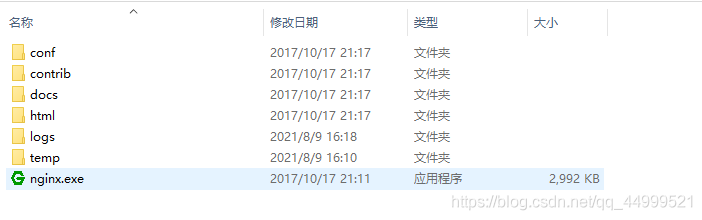

#### 安装

> 直接去官网下载解压即可

## 在window下操作Nginx的基本使用方式

进入解压目录



`直接点击Nginx.exe就可以启动，但不是我们想要的`

#### 启动

以`管理员`身份打开`CMD`命令行

切换目录到刚才`解压的目录`下去


```shell
## 第一种方法，nginx在前台运行，关闭当前命令行窗口时 nginx 自动关闭
D:\nignx\gerenxiangmu\nginx-1.12.2> start nginx
## 第二种
D:\nignx\gerenxiangmu\nginx-1.12.2> nginx.exe
```

> 注：建议使用`第一种`，第二种会使你的` CMD `窗口`一直处于执行`中，**不能进行其他命令操作**。
>
> 第一种`启动后`有一个`弹窗发生1S时间一闪而过`正常现象启动。

#### 停止

```shell
D:\nignx\gerenxiangmu\nginx-1.12.2> nginx.exe -s stop
#or
D:\nignx\gerenxiangmu\nginx-1.12.2> nginx.exe -s quit
```

> 注：stop 是快速停止 nginx，可能并不保存相关信息；quit 是完整有序的停止 nginx，并保存相关信息。

#### 重新载入

```shell
    D:\nignx\gerenxiangmu\nginx-1.12.2> nginx.exe -s reload
```

> 当配置信息修改，需要重新载入这些配置时使用此命令。

#### 重新打开日志文件

```shell
D:\nignx\gerenxiangmu\nginx-1.12.2> nginx.exe -s reopen
```

#### 查看Nginx版本信息

```shell
D:\nignx\gerenxiangmu\nginx-1.12.2> nginx -v
```

> ```shell
> 1. start nginx // 启动ng服务器
> 2. nginx -s reload // 服务杀死后进行重启（每次修改配置需执行此操作）
> 3. nginx -t  //查看配置是否成功（一连串英文字符中出现successful）
> ```