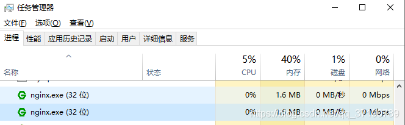
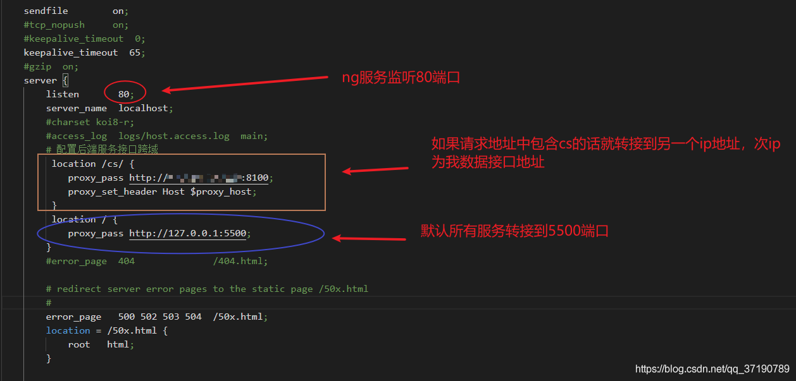
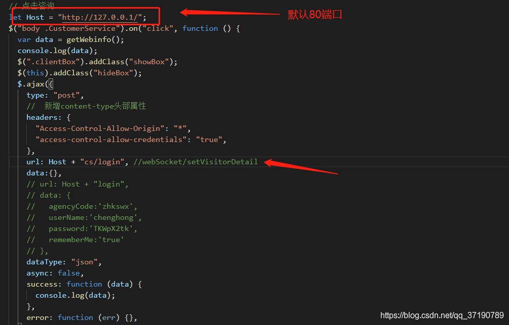
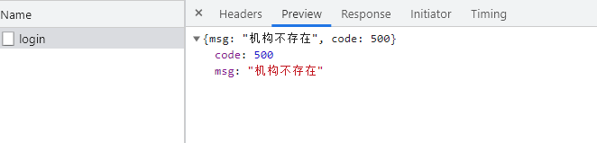

> ```shell
> 1. start nginx // 启动ng服务器
> 2. nginx -s reload // 服务杀死后进行重启（每次修改配置需执行此操作）
> 3. nginx -t  //查看配置是否成功（一连串英文字符中出现successful）
> ```

> `启动成功`的`依据`是你的`进程`中会有`nginx服务`



> 启动成功后就可以开始进行配置了（文件目录：D:\nginx\nginx-1.20.1\conf\nginx.conf,根据自己实际的安装目录）

```shell
server {
        listen       80;
        server_name  localhost;		
        #charset koi8-r;		
        #access_log  logs/host.access.log  main;      
		# 配置后端服务接口跨域
		 location /cs/ {
			proxy_pass http://xx.xxx.xx.xxxx:8100;
			proxy_set_header Host $proxy_host;
		 }		 
		 location / {
            proxy_pass http://127.0.0.1:5500;
		}
		#error_page  404              /404.html;

        # redirect server error pages to the static page /50x.html
        #
        error_page   500 502 503 504  /50x.html;
        location = /50x.html {
            root   html;
        }
     }

```



前端项目启动在`80端口`（但是vscode Open with Live Serve 默认是在5500端口打开）：


其实就是项目`监听url地址`是`80`，但是在`ng`中配置了`80` `转接`到`5500`，也就是`vscode`自带的服务`5500端口`中，然后`项目`中发了`请求`，`请求地址`中包含有`cs的字符串`，于是`nginx`又做了`一次转接`，`三次转接`都在**同一个端口 80**.

前端代理请求接口地址：



于是就请求到了数据，大功告成！！！

