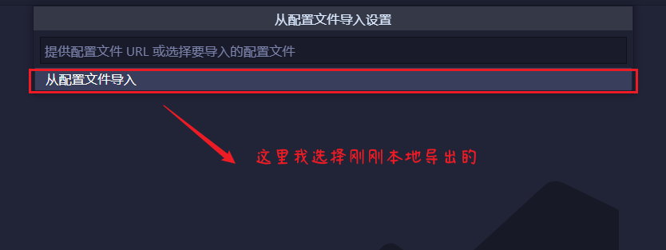

# IDE手动导入导出配置项

众所周知，vscode需要依靠插件来扩展功能。这样的特性，催生出了配置/插件同步功能——vscode可以通过微软账号或github账号，自动同步配置/插件信息。

某些时刻，vscode的配置/插件自动同步，会因为巧遇“科学上网”，莫名失效。遇到这样的情况，怎么办？

其实，vscode自动同步配置/插件的功能。也可以通过手动备份vscode配置文件实现。

## 导出vsCode的配置文件

#### 1.打开命令面板

#### 2.输入对应指令（导出）

`export`

#### 3.选择你要导出的位置

这里我导出到桌面

#### 4.成功导出

## 导入vsCode的配置文件

如果要在其他机器上，手动同步vscode 的配置/插件信息。只需要将导出、备份的配置文件，用vscode导入即可（**`需要互联网`**）

#### 1.打开命令面板

#### 2.输入对应指令（导入）

`import`

#### 3.确定导入并选择位置

#### 4.等待导入

