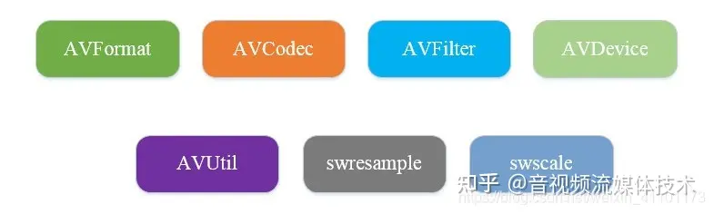
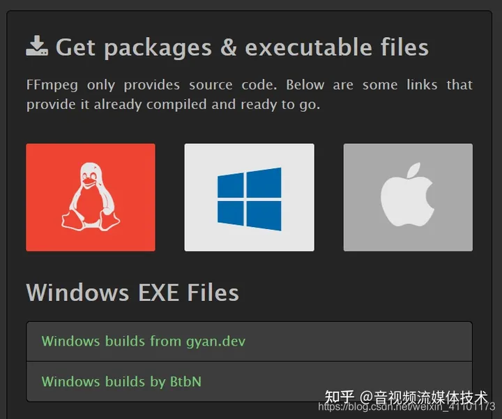
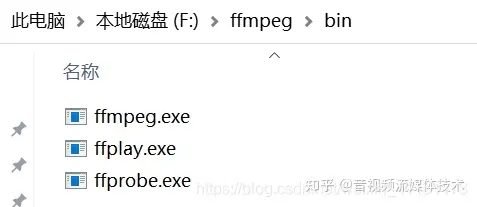

> 中文网站：https://ffmpeg.github.net.cn/

###  1.1简介

`ffmpeg`是广泛使用的多媒体解决方案，既是一款`音视频编解码工具`，同时也是一组`音视频编解码开发套件`，作为编解码开发套件，它为开发者提供了丰富的音视频处理的调用接口。

其包括了目前领先的音/视频编码库` libavcodec`。

`ffmpeg`提供了多种媒体格式的封装和解封装，包括多种音视频编码，多种协议的流媒体，多种色彩格式转换，多种采样率转换，多种码率转换等。ffmpeg发展至今，已经被许多开源项目使用。

### 1.2 基本组成

`ffmpeg`框架的基本组成包含`AVFormat`，`AVCodec`，`AVFilter`，`AVDevice`，`AVUtil`等。

1）`封装模块 - AVFormat`

AVFormat：文件格式和协议库，该模块是最重要的模块之一，封 装了`Protocol`层和`Demuxer`、`Muxer`层，使得协议和格式对于开发者来说 是透明的。

AVFormat中实现了目前多媒体领域中绝大多数媒体封装格式，包括封装和解封装，如MP4，FLV等文件封装格式，RTMP，HLS等网络协议封装格式。ffmpeg是否支持某种封装格式，取决于编译时是否包含了该格式的封装库。

应用于各种音视频封装格式的生成和解析，包括获取解码所需信息以生成解码上下文结构和读取音

视频帧等功能；音视频的格式解析协议，为 libavcodec 分析码流提供独立的音频或视频码流源。

在上一篇文章内重点介绍了封装格式和编码格式的区别。

`2）编解码模块 - AVCodec`

编解码库，该模块也是最重要的模块之一，封装了 `Codec`层。

AVCodec中实现了目前多媒体领域绝大多数常用的编解码格式，既支持编码，也支持解码。AVCodec除了支持自带的媒体解码格式之外，还支持第三方的编解码器，如H.264编码，需要使用x264编码器；MP3编码，需要使用libmp3lame编码器。如果希望增加自己的编码格式，或者硬件编解码，则需要在AVCodec中增加相应的编解码模块。（有一些Codec是具备自己的License的，FFmpeg是不会默认添加像libx264、FDK-AAC、lame等库的，但是FFmpeg就像一个平台 一样，可以将其他的第三方的Codec以插件的方式添加进来，然后为开 发者提供统一的接口）

该库是音视频编解码的核心，avcodec 库被其他各大解码器 ffdshow，Mplayer 等所包含或应用。

`3）滤镜模块 - AVFilter`

AVFilter提供了一个通用的音频，视频，字幕等滤镜处理框架。该模块提供了包括音频特效和视频特效的处理，在使用FFmpeg的API进行编解码的过程中，直接使用该模块为音视频数据做特效处理是非常方便同时也非常高效的一种方式。

`4）视频图像转换计算模块 - swscale`

swscale模块提供了高级别的图像转换API，例如它允许进行图像缩放和像素格式转换，视频场景比例缩放、色彩映射转换；图像颜色空间或格式转换，如gb565 rgb888 与 yuv420 等之间转换。

`5）音频转换计算模块 - swresample`

swresample模块提供了高级别的音频重采样API。可以对数字音频进行 声道数、数据格式、采样率等多种基本信息的转换。例如，它允许操作音频采样，音频通道布局转换与布局调整。

`6）AVUtil - 核心工具库`，该模块是最基础的模块之一，许多其他模块都会依赖该库做一些基本的音视频处理操作。

`7）AVDevice - 硬件采集，加速，显示`。输入输出设备库，比如，需要编译出播放声音或者视 频的工具ffplay，就需要确保该模块是打开的，同时也需要libSDL的预 先编译，因为该设备模块播放声音与播放视频使用的都是libSDL库。

`8）补充一个 AVResample - 音视频封装编解码格式预设等`。比较老的FFmpeg版本，那么有可能还会编译出来avresample 模块，该模块其实也是用于对音频原始数据进行重采样，但是现在已经 被废弃掉了，不再推荐使用该库，而是使用`swrresample`库进行替代。

### 1.3 命令行工具

`ffmpeg`已经编译好了3个常用的工具集- `ffmpeg.exe` `ffprobe.exe` `ffplay.exe`. 通过这3个工具就可以使用命令去操作一个多媒体文件。

下载地址：[Download FFmpeg](https://link.zhihu.com/?target=http%3A//ffmpeg.org/download.html%23build-windows)

将下载好的`exe文件`，取路径配置好`环境变量`，就可以在任意的文件夹内使用`ffmpeg的命令行`了。

逐一介绍一下三大将：

1. `ffmpeg.exe`：ffmpeg主要用于对音视频进行处理，比如说剪切、抽取视频、抽取音频、增加贴纸水印等等。Hyper fast Audio and Video encoder，音视频编解码工具（类似爱剪辑 格式工厂）。
2. `ffplay.exe`：ffplay主要用于播放视频，几乎支持所有的本地视频播放，还能支持流媒体等网络视频播放，甚至还能播放YUV视频，这点在开发过程中非常好用。Simple media player 简单媒体播放器。
3. `ffprobe.exe`：ffprobe主要用于查看音视频文件格式，比如说你要将一个音视频文件的所有信息以JSON格式输出，ffprobe这个命令行就很便捷。Simple multimedia streams analyzer，简单多媒体流分析器。
