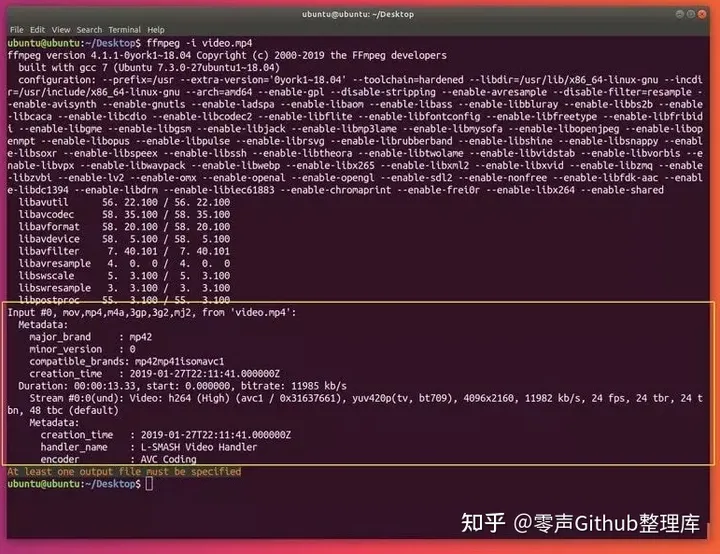
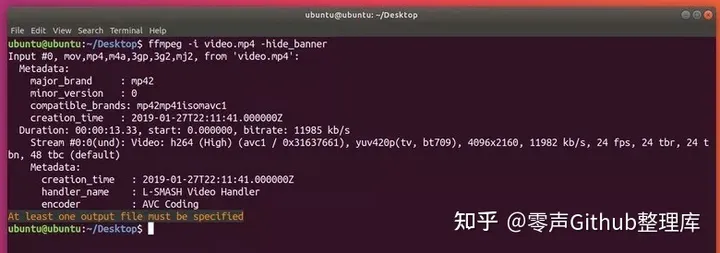

## 如何使用 ffmpeg: 基础

**ffmpeg** 安装就绪了，我来讲述一些使用这个强力工具的基本概念。

### **0. ffmpeg 命令**

使用 **ffmpeg 命令** 的**基本形式**是:

```c
ffmpeg [全局参数] {[输入文件参数] -i 输入文件地址} ... {[输出文件参数] 输出文件地址} ...
```

要注意的是，**所有的参数仅仅对仅接下来的文件有效**（下一个文件得把参数再写一遍）。

**所有没有使用` -i `指定的文件都被认为是输出文件**。 **Ffmpeg** 可以接受多个输入文件并输出到您指定的位置。你也可以将输入输出都指定为同一个文件名，不过这个时候要在输出文件前使用用 **-y** 标记。

> 你不应该将输入和输出混淆，先指定输入，再指定输出文件

### **1. 获得媒体文件的信息**

**ffmpeg** 最简单的使用就是用来 **显示文件信息** 。不用给输出，只是简单的写：

```shell
ffmpeg -i file_name
```

视频和音频文件都可以使用：

```shell
ffmpeg -i video_file.mp4 
ffmpeg -i audio_file.mp3
```



通过ffmpeg查看文件属性

命令会输出很多与您文件无关的信息（ffmpeg本身的信息），虽说这个蛮有用的，你可以使用 **`-hide_banner`** 来隐藏掉它们:

```shell
ffmpeg -i video_file.mp4 -hide_banner 
ffmpeg -i audio_file.mp3 -hide_banner
```



如图所示，现在命令只显示你文件相关的信息了（编码器，数据流等）。

### 2. 转换媒体文件

**ffmpeg** 最让人称道常用的恐怕就是你轻而易举的在不同媒体格式之间进行自由转换了。你是要指明输入和输出文件名就行了， **ffmpeg** 会从后缀名猜测格式，这个方法同时适用于视频和音频文件

下面是一些例子:

```shell
ffmpeg -i video_input.mp4 video_output.avi 
ffmpeg -i video_input.webm video_output.flv 
ffmpeg -i audio_input.mp3 audio_output.ogg 
ffmpeg -i audio_input.wav audio_output.flac
```

你也可以同时指定多个输出后缀：

```shell
ffmpeg -i audio_input.wav audio_output_1.mp3 audio_output_2.ogg
```

这样会同时输出多个文件.

想看支持的格式，可以用：

```shell
ffmpeg -formats
```

同样的，你可以使用 **`-hide_banner`** 来省略一些程序信息。

你可以在输出文件前使用 **`-qscale 0`** 来保留原始的视频质量：

```shell
ffmpeg -i video_input.wav -qscale 0 video_output.mp4
```

进一步，你可以指定编码器，使用 **`-c:a`** (音频) 和 **`g-c:v`** (视频) 来指定编码器名称，或者写 **`copy`** 来使用与源文件相同的编码器：

```shell
ffmpeg -i video_input.mp4 -c:v copy -c:a libvorbis video_output.avi
```

> *这样做会让文件后缀使人困惑，所以请避免这么做。*

### **3. 从视频中抽取音频**

为了从视频文件中抽取音频，直接加一个 `-vn` 参数就可以了：

```shell
ffmpeg -i video.mp4 -vn audio.mp3
```

这会让命令复用原有文件的比特率，一般来说，使用 `-ab` (音频比特率)来指定编码比特率是比较好的：

```shell
ffmpeg -i video.mp4 -vn -ab 128k audio.mp3
```

一些常见的比特率有 `96k`, `128k`, `192k`, `256k`, `320k` (mp3也可以使用最高的比特率)。

其他的一些常用的参数比如 **`-ar`** **(采样率**: 22050, 441000, 48000), **`-ac`** (**声道数**), **`-f`** (**音频格式**, 通常会自动识别的). **`-ab`** 也可以使用 **`-b:a`** 来替代. 比如：

```shell
ffmpeg -i video.mov -vn -ar 44100 -ac 2 -b:a 128k -f mp3 audio.mp3
```

### **4. 让视频静音**

和之前的要求类似，我们可以使用 **`-an`** 来获得纯视频(之前是 **`-vn`**).

```shell
ffmpeg -i video_input.mp4 -an -video_output.mp4
```

> **Note:** *这个 **-an** 标记会让所有的音频参数无效，因为最后没有音频会产生。*

### **5. 从视频中提取图片**

这个功能可能对很多人都挺有用，比如你可能有一些幻灯片，你想从里面提取所有的图片，那么下面这个命令就能帮你：

```shell
ffmpeg -i video.mp4 -r 1 -f image2 image-%3d.png
```

我们来解释一下这个命令：

**`-r`** 代表了帧率（一秒内导出多少张图像，默认25）， **`-f`** 代表了输出格式(**image2** 实际上上 image2 序列的意思）。

最后一个参数 (输出文件) 有一个有趣的命名：它使用 **%3d** 来指示输出的图片有三位数字 (000, 001, 等等.)。你也可以用 **%2d** (两位数字) 或者 **%4d** (4位数字) ，只要你愿意，你可以随便实验 一下可以怎么写！

> **Note:** *同样也有将图片转变为视频/幻灯片的方式，下面的**高级应用**中会讲到。*

### **6. 更改视频分辨率或长宽比**

对 **ffmpeg** 来说又是个简单的任务，你只需要使用 **`-s`** 参数来缩放视频就行了:

```shell
ffmpeg -i video_input.mov -s 1024x576 video_output.mp4
```

同时，你可能需要使用 **`-c:a`** 来保证音频编码是正确的:

```shell
ffmpeg -i video_input.h264 -s 640x480 -c:a video_output.mov
```

你也可是使用**`-aspect`** 来更改长宽比:

```shell
ffmpeg -i video_input.mp4 -aspect 4:3 video_output.mp4
```

> **Note:** 在高级应用中还会提到更强大的方法

### **7. 为音频增加封面图片**

有个很棒的方法把音频变成视频，全程使用一张图片（比如专辑封面）。当你想往某个网站上传音频，但那个网站又仅接受视频（比如YouTube, Facebook等）的情况下会非常有用。

下面是例子：

```shell
ffmpeg -loop 1 -i image.jpg -i audio.wav -c:v libx264 -c:a aac -strict experimental -b:a 192k -shortest output.mp4
```

只要改一下编码设置 (**`-c:v`** 是 视频编码， **`-c:a`** 是音频编码) 和文件的名称就能用了。

> **Note:** *如果你使用一个较新的ffmpeg版本（4.x），你就可以不指定 **-strict experimental***

### **8. 为视频增加字幕**

另一个常见又很容易实现的要求是给视频增加字母，比如一部外文电源，使用下面的命令：

```shell
ffmpeg -i video.mp4 -i subtitles.srt -c:v copy -c:a copy -preset veryfast -c:s mov_text -map 0 -map 1 output.mp4
```

当然，你可以指定自己的编码器和任何其他的音频视频参数。

### **9. 压缩媒体文件**

压缩文件可以极大减少文件的体积，节约存储空间，这对于文件传输尤为重要。通过ffmepg，有好几个方法来压缩文件体积。

> **Note:** 文件压缩的太厉害会让文件质量显著降低。

首先，对于`音频文件`，可以通过**降低比特率**(使用 **`-b:a`** 或 **`-ab`**):

```shell
ffmpeg -i audio_input.mp3 -ab 128k audio_output.mp3
ffmpeg -i audio_input.mp3 -b:a 192k audio_output.mp3
```

再次重申，一些常用的比特率有: `96k`, `112k`, `128k`, `160k`, `192k`, `256k`, `320k`.值越大，文件所需要的体积就越大。

对于`视频文件`，选项就多了，一个简单的方法是通过**降低视频比特率** (通过 **`-b:v`**):

```shell
ffmpeg -i video_input.mp4 -b:v 1000k -bufsize 1000k video_output.mp4
```

> **Note:** 视频的比特率和音频是不同的（一般要大得多）。

你也可以使用 **`-crf`** 参数 (恒定质量因子). 较小的**`crf`** 意味着较大的码率。同时使用 **`libx264`** 编码器也有助于减小文件体积。这里有个例子，压缩的不错，质量也不会显著变化：

```shell
ffmpeg -i video_input.mp4 -c:v libx264 -crf 28 video_output.mp4
```

**`crf`** 设置为`20` 到 `30` 是最常见的，不过您也可以尝试一些其他的值。

**降低帧率**在有些情况下也能有效（不过这往往让视频看起来很卡）:

```shell
ffmpeg -i video_input.mp4 -r 24 video_output.mp4
```

**`-r`** 指示了帧率 (这里是 **24**)。

你还可以通过**压缩音频**来降低视频文件的体积，比如设置为立体声或者降低比特率：

```shell
ffmpeg -i video_input.mp4 -c:v libx264 -ac 2 -c:a aac -strict -2 -b:a 128k -crf 28 video_output.mp4
```

> **Note:** ***-strict -2** 和 **-ac 2** 是来处理立体声部分的。*

### **10. 裁剪媒体文件（基础）**

想要从开头开始剪辑一部分，使用T **-t** 参数来指定一个时间:

```shell
ffmpeg -i input_video.mp4 -t 5 output_video.mp4 
ffmpeg -i input_audio.wav -t 00:00:05 output_audio.wa
```

这个参数对音频和视频都适用，上面两个命令做了类似的事情：保存一段5s的输出文件（文件开头开始算）。上面使用了两种不同的表示时间的方式，一个单纯的数字（描述）或者 **HH:MM:SS** (小时, 分钟, 秒). 第二种方式实际上指示了结束时间。

也可以通过 **-ss** 给出一个开始时间，**-to** 给出结束时间：

```shell
ffmpeg -i input_audio.mp3 -ss 00:01:14 output_audio.mp3
ffmpeg -i input_audio.wav -ss 00:00:30 -t 10 output_audio.wav 
ffmpeg -i input_video.h264 -ss 00:01:30 -to 00:01:40 output_video.h264 
ffmpeg -i input_audio.ogg -ss 5 output_audio.ogg
```

可以看到 **开始时间** (**-ss HH:MM:SS**), **持续秒数** (**-t duration**), **结束时间** (**-to HH:MM:SS**), 和**开始秒数** (**-s duration**)的用法.

你可以在媒体文件的任何部分使用这些命令。

> 原文地址：https://zhuanlan.zhihu.com/p/455572544
